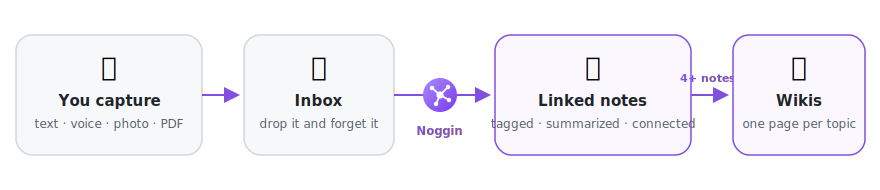
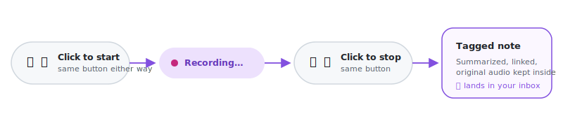

<p align="center">
  
</p>

<h1 align="center">Nous</h1>

<p align="center">
  <a href="https://obsidian.md/plugins?id=nous"></a>
  
  <a href="LICENSE"></a>
</p>

Capture anything — a typed thought, a voice memo, pasted meeting notes, a
photo, a PDF — and Nous turns it into a tagged, linked knowledge graph
inside Obsidian.
Every capture gets summarized and connected to related notes automatically,
and once a topic has enough notes behind it, Nous writes a wiki page
pulling everything together.

No coding needed. Everything happens inside Obsidian.

<picture>
  <source media="(prefers-color-scheme: dark)" srcset="assets/pipeline-dark.svg">
  
</picture>

## Install

1. In Obsidian: **Settings → Community plugins**, turn community plugins on.
2. **Browse**, search **"Nous"**, click **Install**, then **Enable**.

That's it — or use the badge above to jump straight to Nous's page on
[Obsidian's site](https://obsidian.md/plugins?id=nous).

## Quickstart

**1. Enable Nous** — a setup wizard opens automatically and asks one
question: Claude subscription, an API key, or a local model? Pick one, it
tests the connection, done.

**2. Capture something.** Four ways in, all in the left sidebar:

| | |
|---|---|
| ➕ | Type, paste, or attach a file — command palette → "Nous: Quick capture" |
| 🎙️ | A voice note |
| 📞 | Record a meeting (macOS) |
| 📥 | Or just drop any file into `00-Inbox` |

🎙️ and 📞 both work the same way — click to start, talk, click the same
button to stop:

<picture>
  <source media="(prefers-color-scheme: dark)" srcset="assets/capture-scenario-dark.svg">
  
</picture>

| | Extra setup | You get |
|---|---|---|
| 🎙️ Voice note | None | A tagged note, your recording kept inside |
| 📞 Meeting (macOS) | [One-time, ~10 min](examples/meeting-capture/) | A `Me:` / `Them:` labeled transcript |

Want live text as you talk instead of only after? **Live voice transcription
(beta)**, in Nous's settings — see
[`docs/USAGE.md`](docs/USAGE.md#voice-capture-in-depth).

**3. That's it.** Within seconds your capture is tagged, summarized, and
linked to related notes in **`10-Notes`** — original text, image, or
recording kept inside. Topics with 4+ notes get their own wiki page in
**`30-Wikis`** automatically.

## How it works, briefly

- **Transcription is local by default** — [whisper.cpp](https://github.com/ggml-org/whisper.cpp)
  runs on your Mac; voice never leaves it. Falls back to a Gemini/OpenAI key
  if that's not installed.
- **Meetings** are captured via [QuickRecorder](https://github.com/lihaoyun6/QuickRecorder)
  recording system audio and your mic as two separate tracks, transcribed
  independently, then interleaved by timestamp into `Me:` / `Them:` dialogue.
- **Limitation**: group calls lump every other participant into one `Them:`
  speaker — there's no per-person diarization.
- **Limitation**: meeting capture is macOS-only; live voice transcription
  (beta) is OpenAI-only and desktop-only.

Full pipeline detail → [`docs/ARCHITECTURE.md`](docs/ARCHITECTURE.md).

## Good to know

- **Obsidian must be open** for captures to process — they wait in
  `00-Inbox` until it is.
- **Privacy**: only your captured notes and tag names are ever sent to the
  provider you chose. Local mode sends nothing anywhere. No telemetry, ever.
- **Mobile**: use Direct API key mode — Claude Code CLI is desktop-only.
- **Settings** show just the essentials by default — CLI/whisper paths,
  folder names, and tuning thresholds are one click away under **Advanced
  settings**, since defaults work for almost everyone.

New to Nous and want a slower, hand-holding walkthrough of your first hour
with it → **[`docs/TUTORIAL.md`](docs/TUTORIAL.md)**.

Full setup options (every provider, hotkeys, troubleshooting) →
**[`docs/USAGE.md`](docs/USAGE.md)**.

## For developers

```bash
npm install && npm run build && npm test
```

Core logic lives in `src/` with no Obsidian dependency; `main.ts` wires it
to the app. Code map and architecture:
[`docs/TECHNICAL.md`](docs/TECHNICAL.md), [`docs/ARCHITECTURE.md`](docs/ARCHITECTURE.md).

## License

MIT — see [LICENSE](LICENSE).
